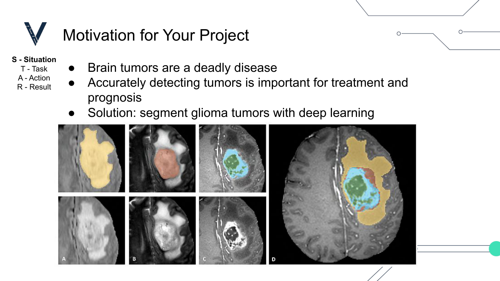
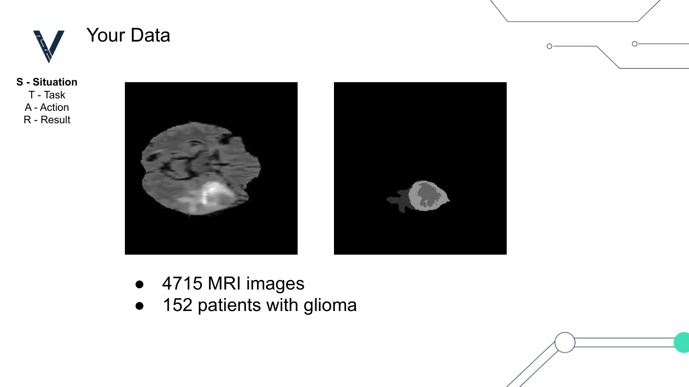
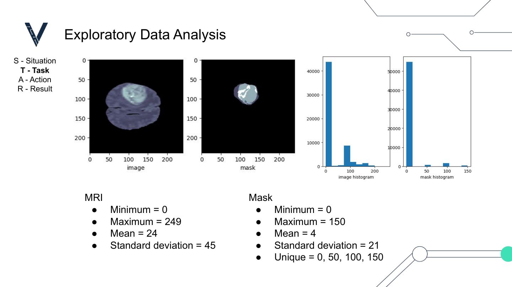
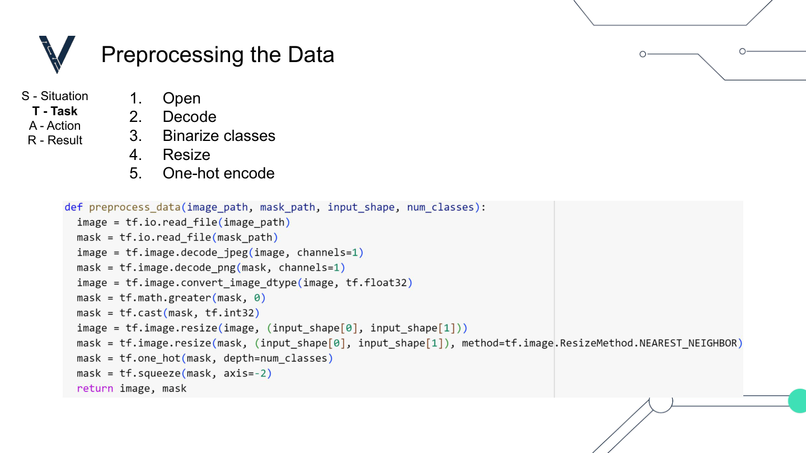
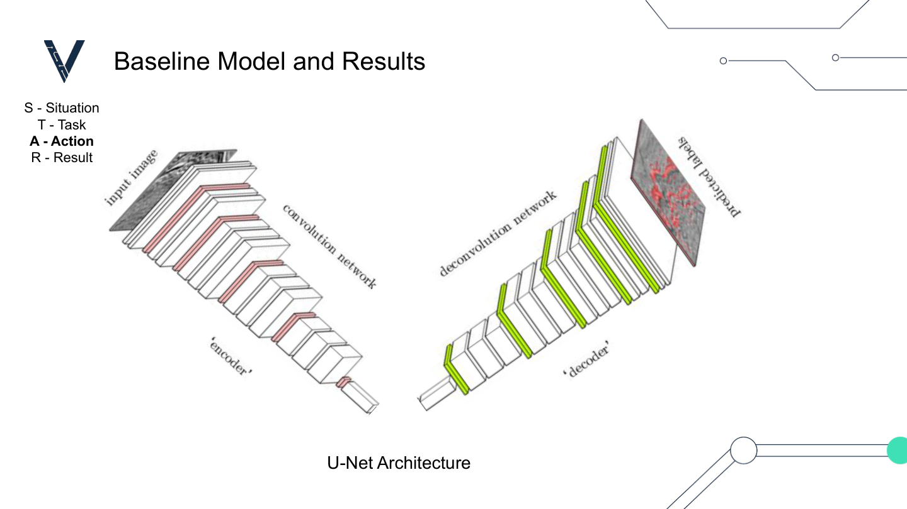
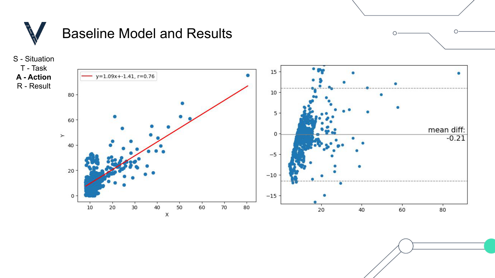
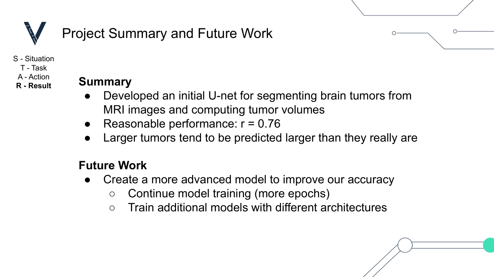

# Brain Tumor Segmentation

Documentary repository for a Veritas AI Capstone project: **glioma tumor segmentation from MRI** with a baseline U-Net, plus patient-level tumor volume estimation.

---

## Motivation

Brain tumors are a deadly disease. Accurately detecting tumors matters for treatment and prognosis. This project segments **glioma** tumors from MRI using deep learning.



---

## Data

Derived from **BraTS 2018**-style slices prepared for the Capstone:

| | |
|---|---|
| MRI slices | **4,715** |
| Patients with glioma | **152** |

Each sample is an MRI slice paired with a segmentation mask.



Expected layout for local training:

```text
data/
  train/images/*.jpg
  train/masks/*.png
  val/images/*.jpg
  val/masks/*.png
```

---

## Exploratory Data Analysis

**MRI**

- Min = 0, Max = 249, Mean = 24, Std = 45

**Mask**

- Min = 0, Max = 150, Mean = 4, Std = 21
- Unique pixel values: `0, 50, 100, 150` (background + multi-region tumor labels)



The baseline model **binarizes** masks: any non-zero label → tumor (class 1).

---

## Preprocessing

Pipeline steps :



Implemented in `src/brain_tumor_segmentation/data.py` as `preprocess_data` and `create_data_pipeline` (`tf.data`, shuffle / batch / prefetch). By default the Colab used a **500-slice** subset for faster iteration; use `--full-dataset` to disable that cap.

---

## Baseline Model

A **2-level U-Net** (encoder → bottleneck → decoder with skip connections), trained with categorical cross-entropy and a tumor Dice metric.



Default settings:

| Setting | Value |
|---|---|
| Input shape | `(120, 120, 1)` |
| Classes | 2 (background / tumor) |
| Batch size | 16 |
| Epochs | 20 |
| Optimizer | Adam |

Model code: `src/brain_tumor_segmentation/models/unet.py`

---

## Results

Patient-level **predicted vs ground-truth tumor volumes** (slice area × 3.5 mm thickness → mL):

- Linear fit: **y = 1.09x − 1.41**, **r = 0.76**
- Bland–Altman mean difference ≈ **−0.21**



---

## Summary & Future Work



**Done**

- Initial U-Net for MRI glioma segmentation and volume estimation  
- Volume correlation **r ≈ 0.76**

**Next**

- Train longer (more epochs)  
- Try additional architectures for higher accuracy  

